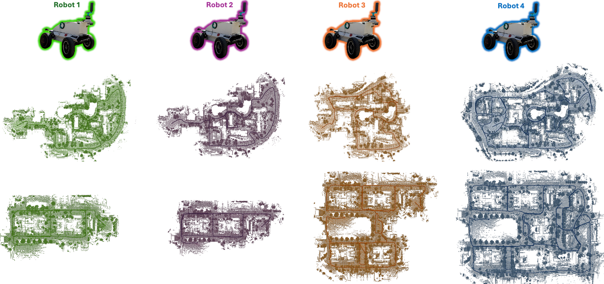
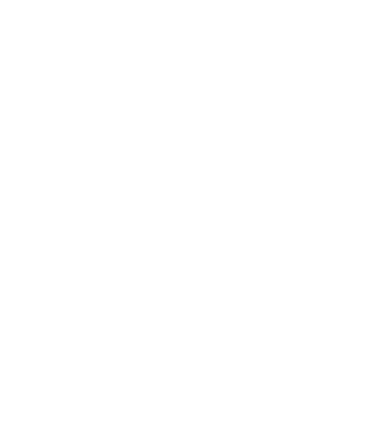
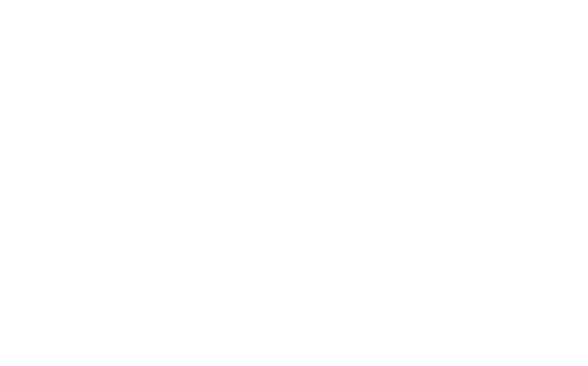

# The CU-Multi Dataset

  

The CU-MULTI Dataset: A dataset aimed to support multi-robot map-merging, inter-robot place recognition and loop-closure detection.

## Download Dataset
**If you would like to download the dataset, you can do so [here](https://app.globus.org/file-manager?origin_id=ae3a873e-d159-4e7b-8a57-9be2699eea52&origin_path=%2F).** A Globus account is required, which you can create using either your institutional or personal email address.

  
  

## Dataset Updates

## ROS2 topics, message types, and associated sensors

| Topic Name                     | Message Type                          | Sensor | Publish Rate        | Description                     |
|--------------------------------|---------------------------------------|--------|-------------|--------------------------------------|
|***\<robot\>_\<env\>_ground_truth.db3***|                               |        |        |                                      |
|&nbsp;&nbsp;&nbsp;&nbsp;&nbsp;&nbsp;`<robot>/ground_truth/path`    | nav_msgs/msg/Path                     | -      | -      | .                                    |
|&nbsp;&nbsp;&nbsp;&nbsp;&nbsp;&nbsp;`<robot>/ground_truth/odometry`| nav_msgs/msg/Odometry                 | -      | 20 Hz  | .                                    |
|&nbsp;&nbsp;&nbsp;&nbsp;&nbsp;&nbsp;`/tf`                          | tf2_msgs/msg/TFMessage                | -      | 20 Hz  |Publishes tf from 'world' frame to robot lidar frame 'robot_ouster_os' at each lidar timestamp.|
| **\<robot\>_\<env\>_lidar.db3**|                                       ||||
| `<robot>/ouster/metadata`      | std_msgs/msg/String                   | LiDAR  | -      | .                                    |
|`<robot>/ouster/points`        | sensor_msgs/msg/PointCloud2           | LiDAR  | 20 Hz  | .                                    |
|`<robot>/ouster/imu`           | sensor_msgs/msg/Imu                   | LiDAR  | 100 Hz | .                                    |
| **\<robot\>_\<env\>_imu_gps.db3**  |||||
| `<robot>/imu/mag`              | sensor_msgs/msg/MagneticField         | IMU    | 500 Hz | .                                    |
| `<robot>/imu/data`             | sensor_msgs/msg/Imu                   | IMU    | 500 Hz | Raw IMU measurements.                |
| `<robot>/imu/pressure`         | sensor_msgs/msg/FluidPressure         | IMU    | 500 Hz | Air pressure measurements.           |
| `<robot>/gnss_1/llh_position`  | sensor_msgs/msg/NavSatFix             | GPS    | 2 Hz   | .                                    |
| `<robot>/gnss_2/llh_position`  | sensor_msgs/msg/NavSatFix             | GPS    | 2 Hz   | .                                    |
| **\<robot\>_\<env\>_camera_rgb.db3** |||||
| `<robot>/camera/color/camera_info` | sensor_msgs/msg/CameraInfo        | RGB-D  | 10 Hz  | Camera intrinsic/distortion parameters. |
| `<robot>/camera/color/image_raw`   | sensor_msgs/msg/Image              | RGB-D  | 10 Hz  | Images captured by front camera.     |
| `<robot>/camera/color/metadata`    | realsense2_camera/msg/Metadata     | RGB-D  | 10 Hz  | ._

We’ll keep this section updated as the dataset evolves. Feel free to [open an issue](https://github.com/arpg/CU-Multi/issues) if anything seems unclear or incomplete.

## Converting to ROS1/ROS2 bag formats
*Please Note*: The order of this is likely to change with a cleaner layout, but this will quickly get you started. 

To convert the dataset to ROS1 bag files, you can use the provided Docker containers in the **dataset_tools** directory following the steps below. Before proceeding further, please make sure you have Docker installed. You can install Docker following the instructions at [this link](https://docs.docker.com/engine/install/). If you are using Arch, you can follow the instructions [here](https://itsfoss.com/install-docker-arch-linux/).

Before installing either (or both) containers, make sure to keep a note on where you download the dataset and where you have cloned this repository (you will need the global location of both). If you are using a unix-based OS, you can find the global location of either by entering the directory and typing ***pwd***.

Update the ***SCRIPTS_DIR*** and ***DATASETS_DIR*** variables ***run_and_enter_container.sh*** bash script with the path of the ***conversion_scripts*** directory (there's one in the ros1 and ros2 folders) you will be using and where you have saved the CU-Multi dataset, respectively. 

### Convert to ROS1 rosbag format

Install and enter the Docker container
1. > cd dataset_tools
2. > cd ros1
3. > sudo bash docker/build_docker.sh
4. > sudo bash run_and_enter_container.bash
5. > source /opt/ros/noetic/setup.bash

While you are in the container, run ***ros_core***. If you want to do this in a tmux session, even better. Open a new window and repeat entering the container like above if not using a tmux session. Now enter ***/root/conversion_scripts*** directory. In this directory is the Python file for converting the unstructured CU-Multi dataset into a ROS1 rosbag file.

First, edit the Python file with the environment and corresponding robot you would like to convert.

Now run the Python file with:

> python3 make_ros1_bag.py. 

### Convert to ROS2 rosbag format

Install and enter the Docker container
1. > cd dataset_tools
2. > cd ros2
3. > sudo bash docker/build_docker.sh
4. > sudo bash run_and_enter_container.bash

Enter the ***/root/conversion_scripts*** directory. In this directory is the Python file for converting the unstructured CU-Multi dataset into a ROS2 db3 file.

First, edit the Python file with the environment and corresponding robot you would like to convert.

Now run the Python file with:

> python3 make_ros2_bag.py. 
